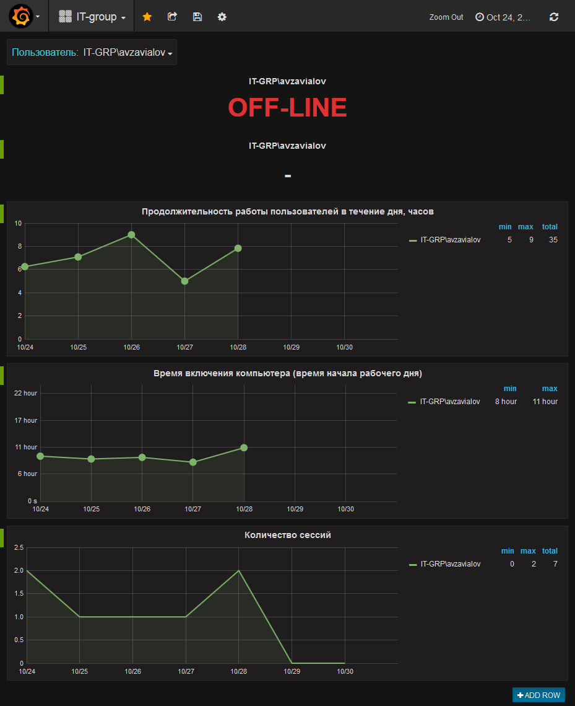

connection_analyzer
===================
Cистема сбора, анализа, хранения и представления журналов событий сетевых служб
-------------------------------------------------------------------------------
Кейс ООО «ИТ-Групп» в рамках конкурса [«Открытый регион. Хакатон-2016»](http://hackathon.permkrai.ru). 

Цель - обеспечить личший контроль и управление предоставляемыми сетевыми службами.

Система необходима для того, чтобы знать:
* кто, когда и с какого устройства работал в сети с заданным IP адресом 
* сетевую активность пользователя (время работы, посещаемые сайты, потребляемый трафик и т.д.)
* местоположение пользователя

Реализованы на языке Ruby с использованием [InfluxDB](https://www.influxdata.com/time-series-platform/influxdb/) и [Grafana](https://grafana.com/) следующие функции:
* сбор и хранение событий от DHCP и NAS серверов, получаемых от NX Log по UDP-соединению
* анализ данных для корреляции событий
* визуализация хранимых событий

*Copyright (C) 2016 Gainanov Ruslan <[ruslan.r.gainanov@gmail.com](mailto:ruslan.r.gainanov@gmail.com)>*